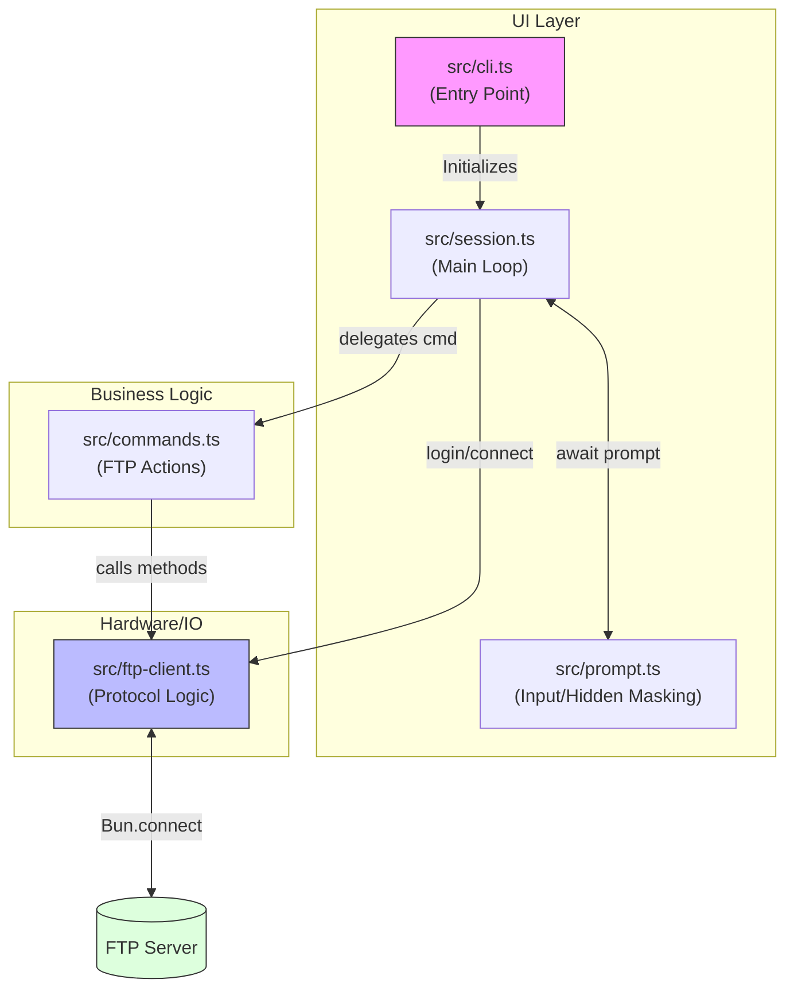

# FTP Client Implementation

## Flow Diagram

```mermaid
graph TD
    %% Files
    CLI["src/cli.ts<br/>(Entry Point)"]
    SESS["src/session.ts<br/>(Main Loop)"]
    CMD["src/commands.ts<br/>(FTP Actions)"]
    PROMPT["src/prompt.ts<br/>(Input/Hidden Masking)"]
    CLIENT["src/ftp-client.ts<br/>(Protocol Logic)"]

    %% Interactions
    CLI -->|Initializes| SESS
    SESS <--->|await prompt| PROMPT
    SESS -->|delegates cmd| CMD
    
    CMD -->|calls methods| CLIENT
    SESS -->|login/connect| CLIENT
    
    CLIENT <--->|Bun.connect| Server[("FTP Server")]

    %% Highlights
    subgraph UI Layer
        CLI
        SESS
        PROMPT
    end

    subgraph Business Logic
        CMD
    end

    subgraph Hardware/IO
        CLIENT
    end

    style CLI fill:#f9f,stroke:#333
    style CLIENT fill:#bbf,stroke:#333
    style Server fill:#dfd,stroke:#333
```
